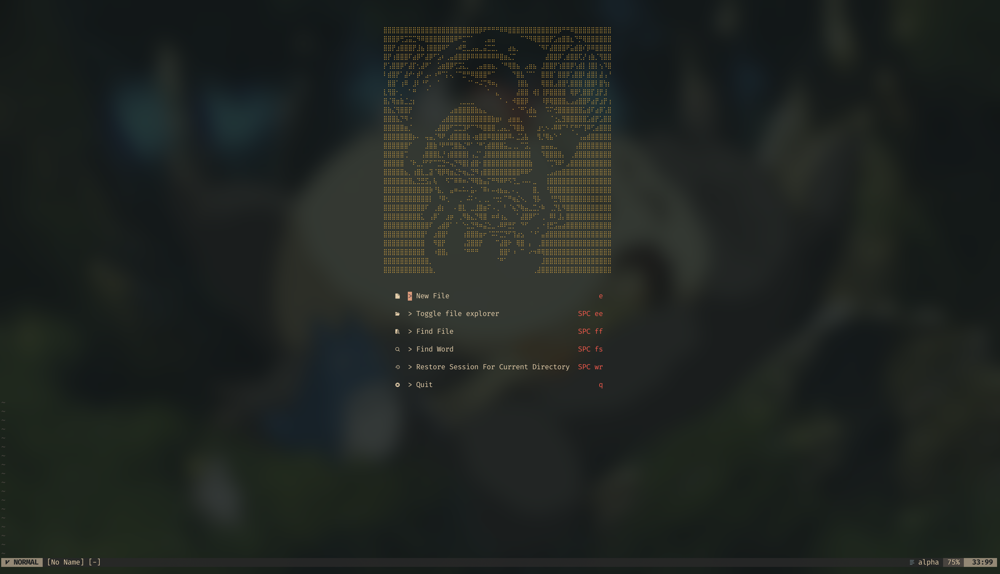
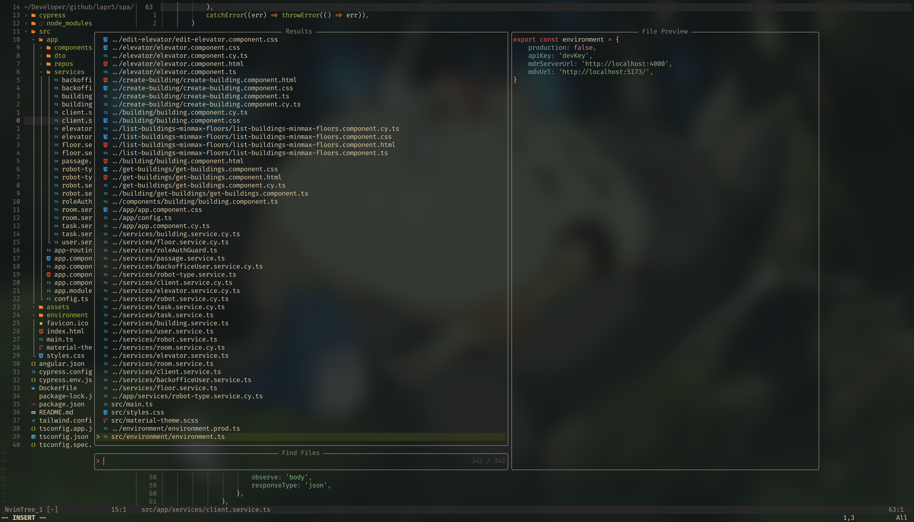
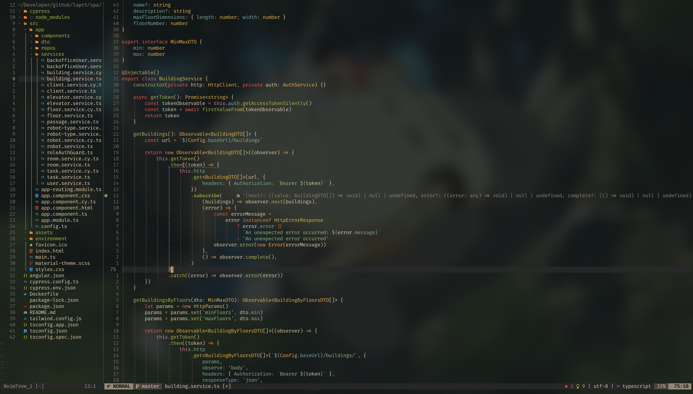

# my neovim configuration

After years of using Integrated Development Environments (IDEs), I decided to
enhance my productivity and transition to neovim as my daily driver. This
repository houses all the configurations I use to ensure a smooth and efficient
development experience.

## screenshots

### start screen



> Using alpha-nvim plugin.

### telescope



### coding



## install

1. Clone the Repository:

   ```sh
   git clone https://github.com/diogonapoles/init.lua ~/.config/nvim
   ```

2. Set the `$NVIM_APPNAME` Environment Variable (optional):

   > If you have multiple neovim configurations, set the `$NVIM_APPNAME`
   > variable to specify which configuration to use, as long as it's in
   > `~/.config/`.

   ```sh
   export NVIM_APPNAME=whatever-name
   ```

3. Install `lazy.nvim`:

   > `lazy.nvim` is the plugin manager I use for neovim.

   ```sh
   git clone --depth 1 https://github.com/folke/lazy.nvim ~/.local/share/nvim/site/pack/lazy/start/lazy.nvim
   ```

4. Install Plugins:

   > Launch neovim and run the following command to install all specified
   > plugins.

   ```sh
   :Lazy sync
   ```

5. Enjoy!
